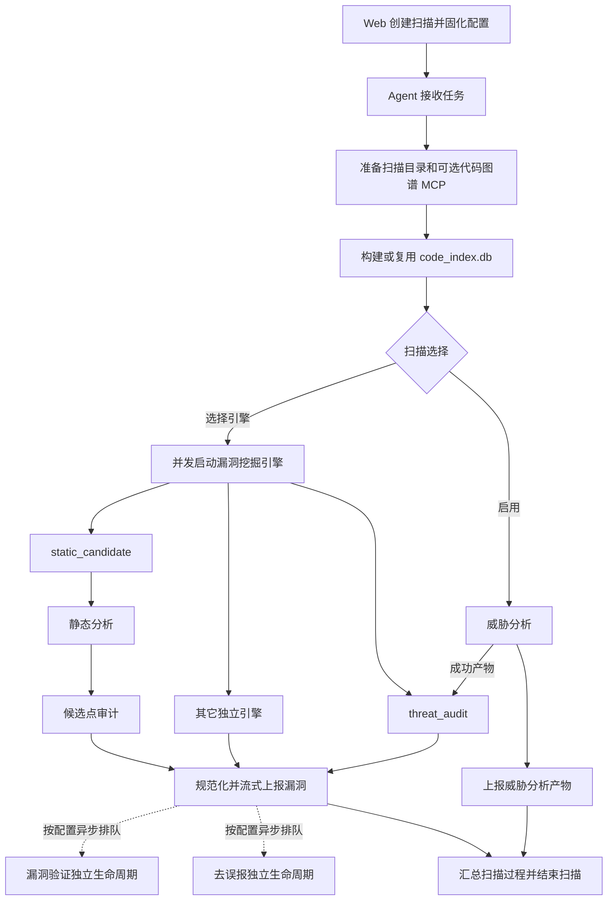

# DeepHole 2.0 框架开发指南

本文面向需要为 DeepHole 2.0 增加扫描能力的开发者，说明 Agent 扫描框架的整体流程、
框架向组件提供的运行能力、组件需要返回的数据，以及不同类型的新组件应如何接入。

本文负责描述统一边界和接入决策；各过程的完整参数仍以对应目录的 README 和实际代码为准：

- [客户端过程总览](../deephole_client/README.md)
- [威胁分析方法扩展](../deephole_client/threat_analysis/README.md)
- [漏洞挖掘引擎扩展](../deephole_client/vulnerability_mining/README.md)
- [去误报方法扩展](../deephole_client/fp_review/README.md)
- [Task Agent 公共任务接口](opencode_task_service.md)
- [漏洞验证方法](vulnerability_validation.md)

## 1. 先选择正确的扩展类型

DeepHole 2.0 并不是把所有新能力都注册成同一种插件。开始开发前，先根据输入和输出选择
最小的接入层：

| 需求 | 应选择的扩展类型 | 是否自动发现 |
| --- | --- | --- |
| 新增一套价值资产、高风险模块和攻击树生成方法 | 威胁分析方法 | 是 |
| 新增一套独立漏洞挖掘方法，并向平台返回漏洞列表 | 漏洞挖掘引擎 | 是 |
| 在“静态召回 → 候选点 AI 审计”链路增加一种规则 | `static_candidate` Checker | 是 |
| 对平台已确认的单个漏洞增加一种去误报方法 | 去误报方法 | 是 |
| 针对一个或多个产品实现漏洞复现或验证方法 | 产品验证器 | 是 |
| 增加新的基础设施阶段、其它扫描级产物或全新任务生命周期 | 独立框架过程 | 否，需要显式接入协调器 |

优先使用前五种扩展点。只有新能力无法表示为威胁分析方法、漏洞挖掘引擎、Checker、去误报方法或产品验证器时，
才增加独立框架过程；独立过程会影响扫描依赖、持久化、状态展示和运行时分发，属于框架级改动。

## 2. 整体扫描流程

Web 服务负责创建任务、固化选择并通过 WebSocket 下发；Agent 在源码所在机器执行所有代码
分析，只把事件、产物和漏洞结论上报服务端。主协调入口是
`deephole_client.scanner.run_scan()`。



实际调度遵循以下规则：

1. 代码图谱构建是扫描的前置基础过程。构建失败时，不启动后续分析。
2. 代码图谱成功后，独立威胁分析和已选漏洞挖掘引擎可以并发执行。
3. `static_candidate` 引擎内部先执行静态分析，再把候选点交给候选点审计。
4. `threat_audit` 是漏洞挖掘引擎，不是威胁分析的一部分；它必须等待威胁分析成功，
   再读取攻击树和高风险模块产物。
5. 不依赖威胁分析产物的其它引擎无需等待威胁分析。
6. 每条漏洞可以在引擎仍运行时流式上报；确认问题会按扫描配置继续排队验证和去误报。
   这两类任务有独立生命周期，不是扫描完成的一般前置条件。单个去误报项目失败或意外取消
   不得阻断后续确认问题的自动入队；未形成有效结论的项目在扫描收尾或手动补跑时再次处理，
   只有用户明确停止去误报才保持扫描级取消状态。
7. 单个引擎失败会被隔离。至少一个已选引擎成功时，扫描可以带警告完成；全部引擎失败时
   扫描失败。仅运行威胁分析时，以威胁分析结果决定扫描状态。
8. 取消信号会向过程和引擎传播；组件必须尽快停止新工作并清理自己启动的子任务或子进程。
9. 续扫按持久化阶段生命周期定向执行。威胁分析先以 `is_resume=True` 调用原生入口；明确
   失败且未取消时，外层协调器归档旧产物并只做一次 `is_resume=False` 的干净回退。已成功
   引擎不会重跑，只有依赖威胁分析的 `threat_audit` 会随恢复补跑。

## 3. 现有组件和返回结果

下面列出 Agent 当前协调的七个业务过程。过程之间只通过参数、文件产物和返回值传递数据，
不应直接导入其它业务过程的内部实现。

| 过程 | 公开入口 | 主要输入 | 主要返回 |
| --- | --- | --- | --- |
| 代码图谱构建 | `run_code_graph_build(**kwargs)` | 项目路径、扫描范围、工作目录 | `status`、`index_db_path`、`cache_hit`、`stats`、`indexer_version` |
| 威胁分析 | `threat_analysis_runner.run_threat_analysis(**kwargs)` | 项目总路径、代码扫描路径、产物目录、恢复标记 | 原生 `result`、失败 `reason`，以及三类 JSON 产物路径 |
| 静态分析 | `run_static_analysis(**kwargs)` | 代码索引、规则目录、Checker 选择 | `status`、`candidates`、`stats` |
| 候选点审计 | `run_candidate_audit(**kwargs)` | 候选点、规则 Skill、代码索引 | `status`、`vulnerabilities`、`processed_keys` |
| 威胁审计 | `run_threat_audit(**kwargs)` | 攻击树、高风险模块、扫描上下文 | `status`、`tasks`、`vulnerabilities` |
| 去误报方法 | `run_fp_review(**kwargs)` | 方法 ID、代码路径、单个漏洞、历史反馈 | 单项 `status`、二元 `verdict`、`reason` 和阶段证据 |
| 漏洞验证 | `run_vulnerability_validation(**kwargs)` | 产品、方法 ID、漏洞批次、全局策略快照和方法 field 值 | `status`、`validations`，或验证方法目录 `catalog` |

普通框架过程的入口统一为异步 `run_<process>(**kwargs)`。每个过程自行校验允许的 key，
未知 key 应立即报错；返回值应可 JSON 序列化。威胁分析的外层入口仍由相邻的
`threat_analysis_runner.py` 提供，所选方法的原生实现位于
`threat_analysis/methods/<method_id>/`，方法目录中不加入平台协调代码。

过程的详细契约见：

- [代码图谱构建](../deephole_client/code_graph_build/README.md)
- [威胁分析方法](../deephole_client/threat_analysis/README.md)
- [静态分析](../deephole_client/vulnerability_mining/engines/static_candidate/static_analysis/README.md)
- [候选点审计](../deephole_client/vulnerability_mining/engines/static_candidate/candidate_audit/README.md)
- [威胁审计](../deephole_client/vulnerability_mining/engines/threat_audit/README.md)
- [去误报方法](../deephole_client/fp_review/README.md)
- [漏洞验证过程](../deephole_client/vulnerability_validation/README.md)

### 3.1 威胁分析方法的原生契约

威胁分析方法按目录自动发现，一个扫描固化并执行一个方法。`method_id` 直接使用目录名；
`method.yaml` 只包含非空 `label` 和 `description`，不配置 `package_name` 或 `default`。平台
缺省固定选择 `deephole_threat_analysis`。

每个方法在 `threat_analysis.py` 定义同步入口，并由 `__init__.py` 导出：

```python
def run_threat_analysis(
    code_path,
    output_path,
    is_resume=False,
    product_mcp=None,
    attack_modes=None,
) -> dict:
    ...
```

成功结果必须设置 `result=True`，并返回 `output_path` 内三份有效 JSON 的
`value_asset_path`、`attack_tree_path`、`high_risk_modules_path`；对应顶层结构分别为数组、
含 `attack_trees` 数组的对象、数组。失败结果必须设置 `result=False` 并提供非空 `reason`。
异常或失败原因会保存到 `ThreatAnalysisRunStatus.error_message`，通过 SSE 和刷新继续显示；
取消使用独立状态。

平台外层入口额外接收 `project_path`，并继续把本次 `code_path` 扫描目录传给原生五参数入口。
威胁分析内部的 Task Agent 上下文以 `code_path` 启动 OpenCode Session；其它过程仍继承扫描器
以 `project_path` 绑定的项目总路径。子目录扫描的最终高风险模块由外层转换为项目根相对
`代码目录`，转换副本与原生续扫产物分离。

更新内置实现时，可把 `ThreatAnalysis/src/threat_analysis_harness/.` 直接复制到
`deephole_client/threat_analysis/methods/deephole_threat_analysis/`，保留该目录的平台
`method.yaml`。原生 `threat_analysis_harness` 绝对导入无需修改。新增方法也沿用相同目录和入口，
只需换目录名并提供清单。完整参数、返回示例和 Skill 注册规则见
[威胁分析方法扩展](../deephole_client/threat_analysis/README.md)。

## 4. 框架向组件提供什么

### 4.1 目录和扫描上下文

漏洞挖掘引擎会收到扁平的 `kwargs`。常用参数按职责分组如下：

| 分类 | 参数 | 说明 |
| --- | --- | --- |
| 身份 | `engine_id`、`engine_label`、`scan_id` | 本次扫描固化的引擎身份和扫描标识 |
| 目录 | `project_path`、`code_scan_path`、`scan_dir`、`work_dir`、`index_db_path` | 只读源码范围、扫描工作目录、引擎可写目录和代码索引 |
| 扫描数据 | `checker_names`、`checker_packages`、`product`、`vulnerability_validation`、`feedback_entries` | 本次扫描的规则、产品、漏洞验证配置和历史反馈快照 |
| 运行状态 | `is_resume`、候选重试参数、威胁审计重试参数 | 续扫和定向重试上下文 |
| 能力 | `config`、`code_graph_mcp`、`knowledge_base_mcp`、`codex_command`、`codex_models` | Agent 只读配置、本次扫描私有 MCP 配置，以及仅向声明依赖 Codex 的引擎提供的基础 argv 前缀和无密钥模型 profile 元数据 |
| 回调 | `output`、`cancel_event`、`report_vulnerabilities` | 事件输出、取消检查和流式漏洞上报 |

框架还会向内置引擎传入 `reporter`；第三方引擎不应依赖该平台对象，应优先使用
`output` 和 `report_vulnerabilities`。`threat_analysis_result` 只传给内置
`threat_audit`，普通扩展引擎不应假设该 key 存在。

服务端续扫命令中的 `retry_mining_engine_ids` 由 Agent 扫描协调器消费，用来筛选本轮实际启动
的引擎，不属于单个引擎的 `kwargs`。因此第三方引擎仍只需通过 `is_resume` 和自己的细粒度
重试参数决定内部恢复方式。

第三方引擎的可写目录固定为：

```text
<scan_dir>/mining_engines/<engine_id>/
```

源码目录和代码索引应视为只读。临时文件、外部工具输出和模型产物都写入 `work_dir`，
不要写入项目源码目录或共享 Agent 安装目录。

### 4.2 模型、MCP 和 Skill 能力

需要模型的组件统一调用：

```python
from pathlib import Path

from task_agent import opencode_task_context, run_opencode_task

SKILL_ROOT = Path(__file__).resolve().parent / "skills"

with opencode_task_context(
    project_dir=kwargs["project_path"],
    work_dir=kwargs["work_dir"],
    scan_id=kwargs["scan_id"],
    feedback_entries=kwargs["feedback_entries"],
    skill_paths=[SKILL_ROOT],
    cancel_event=kwargs["cancel_event"],
):
    result = await run_opencode_task(
        task_name="project-audit-my-engine",
        task_type="vulnerability_mining",
        prompt=prompt,
        required_capability="high",
        output_schema=RESULT_SCHEMA,
    )
```

完整 Agent 已在外层绑定扫描级项目目录、模型池、超时与重试策略、扫描级 MCP、输出回调和
取消信号。扩展引擎应像上例一样嵌套 `opencode_task_context()`，把框架分配的引擎
`work_dir` 和相邻 Skill 根绑定到自己的模型任务；省略的上下文字段继续继承外层配置。
组件不应：

- 自行启动 `opencode`、`nga` 或其它 AI CLI；
- 直接操作模型队列、Lease 或 OpenCode Session API；
- 导入后端配置或通过平台内部对象绕过权限；
- 假设框架会把 JSON Schema 自动追加到首次 Prompt。

调用方需要把首次输出要求和 JSON Schema 明确写入 `prompt`。Task Agent 负责模型调度、
同 Session JSON 纠正、新 Session 重试、取消和结构化结果校验。详细规则见
[Task Agent 公共任务接口](opencode_task_service.md)。

### 4.3 统一过程事件

过程事件使用下面的基础结构：

```json
{
  "process": "candidate_audit",
  "kind": "log",
  "message": "Candidate audit started",
  "data": {}
}
```

字段约定：

- `process`：稳定的过程名称，用于控制台、扫描日志和前端路由。
- `kind`：事件类型，例如 `log`、`progress`、`item`、`artifact`、`task_status`。
- `message`：适合用户阅读的简短状态，不放完整模型正文或工具返回。
- `data`：结构化附加数据；进度使用 `current`、`total`，任务生命周期放完整任务快照。

框架传给引擎的 `output` 是异步回调，应使用 `await output(event)`。可独立提取的过程可以同时
兼容同步和异步 callable。没有细粒度进度时也应定期报告仍在运行，避免长任务看起来失联。

### 4.4 取消、错误和流式结果

- `cancel_event` 提供同步 `is_set()`。循环、批处理和外部命令等待期间都要检查它。
- 收到 `asyncio.CancelledError` 时先做必要清理，然后继续抛出；不要把平台取消伪装成普通成功。
- 外部命令使用独立 argv 启动，取消时先终止，超时后再强制结束；不要拼接 shell 字符串。
- 组件错误应带可操作的 `error_message`，框架负责隔离单引擎失败并发布生命周期。
- 威胁分析方法可以返回非空 `reason` 或抛出异常；框架会持久化简明错误并在详情页展示，
  但组件不得上传完整堆栈、模型正文或密钥。
- `report_vulnerabilities()` 用于尽早展示结果。已经流式上报的漏洞仍必须出现在最终
  `vulnerabilities` 中，框架会做本次运行内的去重和收尾补报。

## 5. 新增漏洞挖掘引擎

### 5.1 目录和清单

在 `deephole_client/vulnerability_mining/engines/` 下创建普通目录：

```text
engines/
└── my_engine/
    ├── engine.yaml
    ├── engine.py
    └── skills/             # 可选
```

目录名就是 `engine_id`，首字符必须是字母或数字，后续只能包含字母、数字、点、下划线和
连字符，总长度不超过 128 个字符。引擎目录不能是符号链接。

`engine.yaml` 接受三个必填字段和一个可选字段：

```yaml
label: 我的漏洞挖掘引擎
description: 说明输入、检测能力和适用范围。
fp_review: true
requires_codex: true
```

- `label` 和 `description` 必须是非空字符串。
- `fp_review` 必须是 YAML 布尔值，只用于界面说明引擎是否自带去误报能力；它不会关闭或
  自动开启平台统一的去误报流程。
- `requires_codex` 可以省略，缺省为 `false`；设为 YAML 布尔值 `true` 时，Agent 启动会提前
  准备 Codex CLI，并在不可用时只阻止该引擎执行。可用时引擎从 `kwargs["codex_command"]`
  取得可直接追加参数的无 shell argv 前缀，并从 `kwargs["codex_models"]` 取得用户级
  OpenCode 模型所对应的 profile。每个模型项包含 `id`、`provider_id`、`model_id`、`profile`
  和已追加 `--profile` 的 `command`，不包含 URL 或凭据；同步失败或没有显式模型时列表为空，
  引擎仍可用基础命令调用用户的 Codex 默认配置。
- 未知字段、缺失字段或非法目录只会隔离当前引擎，不影响其它有效引擎发现。

OpenCode 模型同步只读取用户配置目录下的 `opencode.json` / `opencode.jsonc`，不会读取项目、
可执行文件旁、显式路径或平台模型池配置。生成文件位于 `$CODEX_HOME`，带 OpenDeepHole 托管
标记且权限仅限当前用户；用户 `config.toml`、默认模型和非托管 profile 始终保持原样。Codex
低于 0.134、源配置无效或 profile 写入失败都只产生脱敏告警，不会阻止 Agent 或非 Codex 引擎。
框架不探测模型端点；自定义 provider 的 Responses 协议兼容性在引擎实际调用时确定。

新增目录后不需要修改中央注册表。新建扫描页面直接读取当前代码仓中的有效引擎清单；
扫描创建后使用已固化的引擎 ID 和名称快照。

### 5.2 唯一入口

`engine.py` 必须精确定义一个异步入口：

```python
async def run(**kwargs):
    project_path = kwargs["project_path"]
    work_dir = kwargs["work_dir"]
    cancel_event = kwargs["cancel_event"]
    report_vulnerabilities = kwargs["report_vulnerabilities"]

    vulnerabilities = []
    # 执行引擎自己的分析逻辑，并按需流式上报。
    if vulnerabilities:
        await report_vulnerabilities(vulnerabilities)

    return {
        "status": "cancelled" if cancel_event.is_set() else "success",
        "vulnerabilities": vulnerabilities,
        "error_message": "",
        "total_candidates": 0,
        "processed_candidates": 0,
    }
```

同步函数、位置参数、命名参数或多个参数都会在加载时被拒绝。引擎只读取自己需要的 key；
框架以后增加新的 kwargs 不会破坏 `**kwargs` 入口。

### 5.3 引擎返回值

`run()` 必须返回字典：

| 字段 | 必填 | 约定 |
| --- | --- | --- |
| `status` | 是 | 只能是 `success`、`error` 或 `cancelled` |
| `vulnerabilities` | 是 | 漏洞或审计记录字典列表；没有结果时返回 `[]` |
| `error_message` | 否 | 失败原因，默认空字符串 |
| `total_candidates` | 否 | 非负整数，默认 `0` |
| `processed_candidates` | 否 | 非负整数，默认 `0` |

未知顶层字段会被忽略。返回值不是字典、缺少必填字段、状态非法或字段类型错误时，
框架会将该引擎标记为失败，并在错误中包含引擎 ID 和字段位置。

每个 `vulnerabilities` 元素至少返回：

```json
{
  "vulnerability_report": "# 漏洞报告\n\n完整的分析结论。"
}
```

`vulnerability_report` 是下游唯一保证非空的漏洞信息。推荐尽可能补充：

| 分类 | 可选字段 |
| --- | --- |
| 定位与分类 | `file`、`line`、`function`、`vuln_type`、`severity`、`description` |
| 判断状态 | `confirmed`、`ai_verdict`、`failure_reason` |
| 漏洞证据 | `impact`、`vulnerable_code`、`call_chain`、`attack_entry`、`root_cause`、`trigger_conditions`、`ai_analysis` |
| 来源上下文 | `analysis_source`、`source_task_id`、威胁节点/路径字段、`output_source` |

`confirmed` 未提供时默认按已确认问题处理。`engine_id`、`engine_label`、人工结论和工单字段
由平台可信状态覆盖，引擎不要依赖自己填写这些字段。

可复制的完整实现位于：

- [Skill 引擎示例](../deephole_client/vulnerability_mining/examples/example_skill/engine.py)
- [外部 CLI 引擎示例](../deephole_client/vulnerability_mining/examples/example_cli/engine.py)
- [Codex 引擎示例](../deephole_client/vulnerability_mining/examples/example_codex/engine.py)

示例位于 `examples/`，不会自动加载；复制到 `engines/<engine_id>/` 后才会进入生产发现。

## 6. 新增 static_candidate Checker

Checker 适用于“静态宽召回 + 针对候选点的 AI 审计”。每条规则把静态代码和审计 Skill
放在同一个目录：

```text
vulnerability_mining/engines/static_candidate/rules/mycheck/
├── checker.yaml
├── analyzer.py                         # 可选
├── *.yml                               # 可选 Semgrep 等资源
└── skills/mycheck/
    ├── SKILL.md
    ├── SCENARIOS.md                    # 可选
    ├── references/                     # 可选
    ├── scripts/                        # 可选
    └── assets/                         # 可选
```

最小 `checker.yaml`：

```yaml
name: mycheck
label: MYCHECK
description: 我的自定义漏洞检测
enabled: true
mode: opencode
```

`SKILL.md` 的 YAML frontmatter `name` 必须与 Skill 目录名一致。一条规则有多个 Skill 时，
通过 `checker.yaml.skill_name` 选择；未配置时必须恰好存在一个 Skill。

### 6.1 静态 Analyzer

需要静态召回时，`analyzer.py` 必须导出 `Analyzer(BaseAnalyzer)`：

```python
from pathlib import Path

from ...static_analysis.base import BaseAnalyzer, Candidate, scoped_functions


class Analyzer(BaseAnalyzer):
    vuln_type = "mycheck"

    def find_candidates(self, project_path: Path, db=None):
        if db is None:
            return []
        results = []
        functions = scoped_functions(db, project_path)
        for index, function in enumerate(functions):
            if self.on_file_progress:
                self.on_file_progress(index + 1, len(functions))
            # 根据索引或源码判断是否生成候选点。
        return results
```

Analyzer 契约：

- 类名必须是 `Analyzer`，并继承 `BaseAnalyzer`。
- `vuln_type` 必须与 `checker.yaml.name` 一致。
- `find_candidates()` 返回 `Iterable[Candidate]`。
- 使用代码索引时优先调用 `scoped_functions(db, project_path)`，保证子目录扫描范围正确。
- 没有 `analyzer.py` 的 `opencode` Checker 会生成一个 `function="__project__"` 的项目级候选，
  适合只依赖 Skill 的全项目审计。

`Candidate` 必须包含：

| 字段 | 类型 | 说明 |
| --- | --- | --- |
| `file` | `str` | 相对项目根目录的源码路径或项目级扫描范围 |
| `line` | `int` | 候选行号；项目级候选使用 `1` |
| `function` | `str` | 函数名；项目级候选使用 `__project__` |
| `description` | `str` | 中性、简短的审计问题 |
| `vuln_type` | `str` | 与 Checker 名称一致的漏洞类型 |
| `related_functions` | `list[str]` | 可选关联函数 |
| `metadata` | `dict` | 可选结构化上下文 |

建议在 `metadata.subject` 中记录要判断的变量或表达式，它会参与候选合并、Prompt 构造和
同模式过滤；`metadata.problem` 可用于保留统一的问题类型说明。不要把静态规则细节或
未经确认的漏洞结论写进 `description`。

### 6.2 发现、同步和测试

新增或修改规则后无需重启后端。后端在列表刷新和开始扫描时重新发现规则，并把本次选择的
规则快照同步给 Agent；已经运行的扫描继续使用启动时的快照。

本地测试无需启动后端：

```bash
PYTHONPATH=. python3 tools/checker_test.py mycheck /path/to/source \
  --min-candidates 1

# 可选：对一个候选运行真实模型审计。
PYTHONPATH=. python3 tools/checker_test.py mycheck /path/to/source \
  --audit --audit-limit 1 --task-agent-config ./task-agent.yaml
```

测试阶段可以设置 `visibility: admin`，验证完成后改为 `visibility: public`。

## 7. 新增产品验证器

产品验证器位于：

```text
deephole_client/vulnerability_validation/product_validators/<method>/
├── validator.yaml
├── validator.py
└── ...                                  # 可选辅助模块和只读资源
```

方法 ID 直接使用目录名。`validator.yaml` 只允许非空 `label`、非空 `description`、非空产品
列表 `product` 和可选动态参数列表 `field`。动态字段在新建扫描页填写；客户端配置页只维护
所有验证方法共用的漏洞类型、并发、重试和模型策略。框架按目录自动发现，非法方法会被隔离，
不影响其它验证器；旧版验证环境和 `registrations` 清单不再加载。

唯一线上入口必须是：

```python
from ...sdk import ValidationResult


async def validate(**kwargs) -> ValidationResult:
    await kwargs["emit_stdout"]("验证过程", "开始验证")
    return ValidationResult(
        validation_success=True,
        is_problem=True,
        status="verified",
        summary="验证完成",
    )
```

框架向验证器提供三类数据：

1. 漏洞数据：只保证 `report_markdown` 非空；文件、函数、行号、漏洞类型和调用链都可能缺失。
2. 用户配置：`validator.yaml` 的 `field` 声明的每个字段都会出现在 kwargs；可选字段没有值和
   默认值时为 `None`，必填字段缺失时不会启动验证。
3. 运行能力：`project_path`、`code_scan_path`、独立 `work_dir`、取消检查、
   `emit_stdout`、`publish_artifact`、`run_command`、模型能力和重试参数。

`validate()` 必须返回 `ValidationResult`，不能返回字典或元组：

| 字段 | 说明 |
| --- | --- |
| `validation_success` | 验证流程是否完整执行成功 |
| `is_problem` | 最终是否确认漏洞存在 |
| `summary` | 可直接展示的最终结论 |
| `status` | 通常为 `verified`、`failed` 或 `cancelled` |
| `requires_human_intervention` | 是否仍需人工处理 |
| `artifacts`、`validation_code` | 可选最终产物；实时产物优先使用 `publish_artifact` |

完整 manifest、kwargs 和示例见[漏洞验证方法](vulnerability_validation.md)。

## 8. 新增去误报方法

在 `deephole_client/fp_review/methods/` 下创建方法目录，目录名就是 `method_id`：

```text
methods/
└── my_method/
    ├── method.yaml
    ├── method.py
    └── skills/             # 可选，自动加入当前任务的 Skill 搜索路径
```

`method.yaml` 必须声明非空 `label`、`description`，布尔值 `default`，正整数
`max_concurrency`，以及 `stages` 和 `documents` 列表。仓库中必须恰好有一个可加载方法设置
`default: true`；非法方法会被隔离并出现在目录接口的错误列表中。阶段 key、页面名称、说明文档
和 Agent 并发度全部来自该清单，新增方法不修改中央枚举或前端组件。

`method.py` 的唯一入口为：

```python
async def run(**kwargs) -> dict:
    vulnerability = kwargs["vulnerability"]
    vuln_index = kwargs["vuln_index"]
    ...
```

每次调用只处理一个漏洞。必填参数为 `method_id`、`project_path`、`code_scan_path`、
`work_dir`、`scan_id`、`review_id`、`vuln_index` 和 `vulnerability`；每个漏洞有独立工作目录。
成功返回必须包含 `status="success"`、二元 `verdict`（`true_positive` 或
`false_positive`）和非空 `reason`，阶段输出只能使用清单声明的 key。扫描级队列、并发、取消、
补跑和持久化由平台负责；方法不得读取或汇总其它漏洞，也不得生成跨漏洞结论。

完整清单、可选参数和 CLI 示例见[去误报方法扩展](../deephole_client/fp_review/README.md)。

## 9. 新增独立框架过程

独立过程不是目录自动发现插件。只有新能力具有自己的扫描级生命周期、产物或依赖关系时，
才按下面步骤接入：

1. 在 `deephole_client/<process>/` 建立自包含包，提供异步
   `run_<process>(**kwargs)` 门面、输入校验、README，并按需提供 `python -m` CLI。
2. 同步实现通过 `task_agent.run_sync_component()` 接入异步门面；需要模型时只调用
   `run_opencode_task()`。
3. 过程不导入 `backend`、`mcp_server`、Reporter、Server 或其它业务过程；平台适配放在
   过程目录之外。
4. 定义标准事件、取消行为、可 JSON 序列化的返回值，以及失败时是否允许复用旧产物。
5. 在协调器中明确前置依赖、并发关系、恢复/重试和扫描最终状态；如需页面展示，再补齐服务端
   持久化、API/SSE 和前端生命周期。
6. 增加独立抽取、公开入口、CLI、运行时打包和协调器分支测试。

如果新过程只是产生漏洞列表，应改为漏洞挖掘引擎；如果只是增加静态规则、单漏洞去误报方式
或产品验证方式，应分别使用 Checker、去误报方法或验证器扩展点，避免把业务逻辑硬编码进
`scanner.py`。

## 10. 提交前检查

### 通用检查

- [ ] 选择了最小扩展层，没有不必要地修改扫描协调器。
- [ ] 组件只写自己的 `work_dir`，不修改源码目录。
- [ ] 长循环、并发任务和外部进程都响应取消。
- [ ] 事件只包含可展示状态，进度字段稳定且不会泄露敏感正文。
- [ ] 错误路径返回明确原因，空结果与运行失败可以区分。
- [ ] 使用模型时只调用 `run_opencode_task()`，并在首次 Prompt 中自行声明输出 Schema。

### 按扩展类型检查

- 新引擎：运行 `PYTHONPATH=. python3 -m pytest -q tests/test_vulnerability_mining_engines.py`。
- 新 Checker：先运行 `tools/checker_test.py`，再运行对应 Analyzer/Semgrep 的定向测试。
- 新去误报方法：运行 `PYTHONPATH=. python3 -m pytest -q tests/test_fp_review_methods.py`。
- 新验证器：运行 `PYTHONPATH=. python3 -m pytest -q tests/test_vulnerability_validation.py`。
- 新独立过程：运行 `PYTHONPATH=. python3 -m pytest -q tests/test_runner_mode_dispatch.py tests/test_deephole_client_processes.py`。
- 涉及前端展示时，从 `frontend/` 运行 `npm run build`。
- 所有改动提交前运行 `git diff --check`，并确认只暂存本次范围内的文件。
